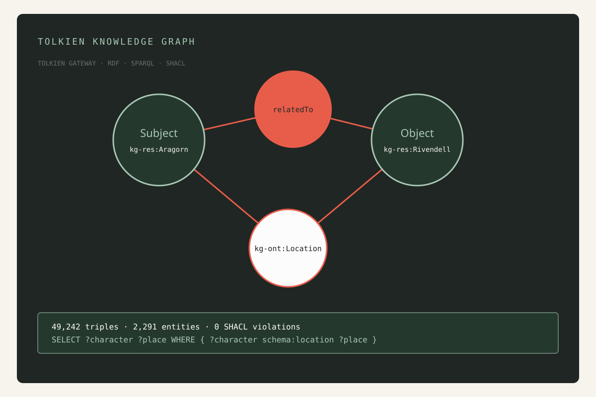
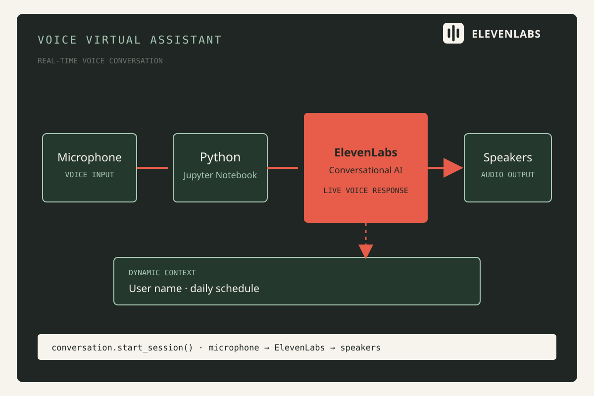
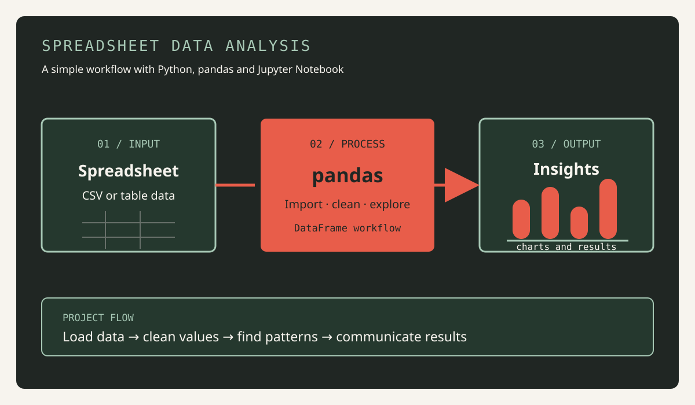

# MATHIASCW.github.io

Personal portfolio of Mathias Chane Waye, built with Angular. The website presents my background, selected projects and contact details in French and English.
You can view my personal portfolio at https://mathiascw.github.io.

## Projects

### MergeDoc

- **Category:** Personal project
- **Summary:** Local document workspace for combining PDFs, images and Office documents into one PDF in the chosen order. It includes drag-and-drop upload, file ordering, watermark options and automatic merging.
- **Technologies:** Python, FastAPI, React, Vite, Pillow
- **Source:** [MATHIASCW/merge_doc](https://github.com/MATHIASCW/merge_doc)


### Tolkien Knowledge Graph

- **Category:** Academic project
- **Summary:** Complete knowledge graph built from Tolkien Gateway, covering wiki extraction, RDF transformation, ontology alignment, SPARQL querying, SHACL validation, reasoning and Linked Data publication.
- **Technologies:** Python, FastAPI, RDFLib, RDF/Turtle, SPARQL, pySHACL, Apache Jena Fuseki
- **Results:** 49,242 triples, 2,291 entities and 0 SHACL violations
- **Source:** [MATHIASCW/Semantic-Web-project](https://github.com/MATHIASCW/Semantic-Web-project)



### Voice Virtual Assistant

- **Category:** Personal project
- **Summary:** Proof of concept for a real-time voice assistant using ElevenLabs Conversational AI. The assistant uses microphone and speakers, with dynamic context such as a user name and daily schedule.
- **Technologies:** Python, Jupyter Notebook, ElevenLabs Conversational AI, python-dotenv
- **Source:** [MATHIASCW/Voice-Virtual-Assistant-with-ElevenLabs](https://github.com/MATHIASCW/Voice-Virtual-Assistant-with-ElevenLabs)



### Spreadsheet Data Analysis

- **Category:** Personal project
- **Summary:** Python notebook for importing, cleaning, exploring and visualising spreadsheet data.
- **Technologies:** Python, pandas, Jupyter Notebook
- **Source:** [MATHIASCW/analyze-spreadsheet-data-with-pandas](https://github.com/MATHIASCW/analyze-spreadsheet-data-with-pandas)



## Portfolio features

- Bilingual navigation in French and English
- Profile page with education, internships, contact details, skills, certifications, languages and mobility
- Detailed visual presentation for every selected project
- Responsive layout for desktop and mobile
- Static deployment on GitHub Pages

## Project structure

```text
src/
├── app/
│   ├── core/       # Shared services, such as language state
│   ├── data/       # Static portfolio data
│   ├── models/     # TypeScript interfaces
│   ├── app.*       # Root layout and navigation
│   ├── profile-page.*
│   └── projects-page.*
├── assets/         # Project images and visual assets
├── main.ts         # Angular bootstrap and routes
├── styles.css      # Global tokens and base styles
└── CNAME           # GitHub Pages custom domain
```

## Local development

```bash
npm install
npm start
```

Then open `http://localhost:4200`.

To use another port, pass the Angular option directly:

```bash
npx ng serve --port 4300
```

## Deployment

The GitHub Actions workflow automatically publishes `dist/mathias-portfolio/browser` to GitHub Pages on every push to `main`. In the repository settings, choose **Pages > GitHub Actions** as the source.

The production build can be checked locally with:

```bash
npm run build
```
