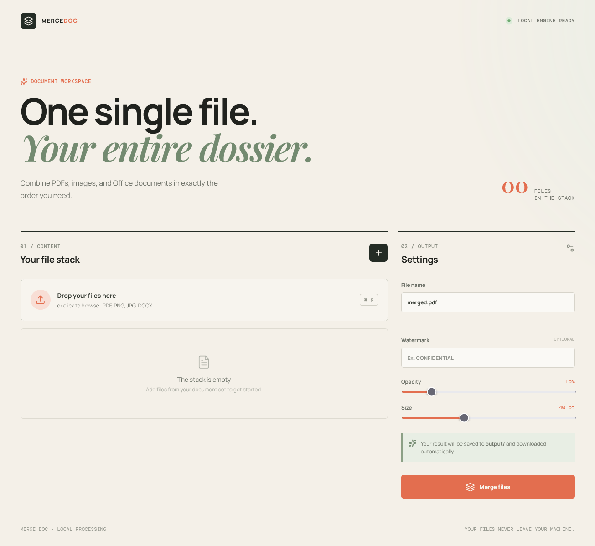

# MATHIASCW.github.io

Personal portfolio of Mathias Chane Waye, built with Angular. The site presents my background, selected projects and contact details in French and English.

## Current features

- Bilingual portfolio navigation (French / English)
- Profile page with education, internships, contact details, skills, certifications, languages and mobility
- Project page with detailed presentations of MergeDoc and the Tolkien Knowledge Graph
- Responsive layout for desktop and mobile
- Static deployment on GitHub Pages

## Featured project: MergeDoc

MergeDoc is a local document workspace for combining PDFs, images and Office documents into one PDF in the chosen order. The project includes a React/Vite interface and a local FastAPI service, with drag-and-drop upload, file ordering, watermark options and automatic merging.



Source code: [MATHIASCW/merge_doc](https://github.com/MATHIASCW/merge_doc)

## Selected projects

- **Tolkien Knowledge Graph**: academic project built from Tolkien Gateway. The pipeline covers wiki extraction, RDF/Turtle transformation, ontology alignment, SPARQL querying, SHACL validation and publication through FastAPI and Apache Jena Fuseki. The final graph contains 49,242 triples and 2,291 entities, with 0 SHACL violations. See the [project repository](https://github.com/MATHIASCW/Semantic-Web-project).
- **MergeDoc**: personal document-merging tool using Python, FastAPI, React, Vite and Pillow.

## Project structure

```text
src/
├── app/
│   ├── core/       # Shared services, such as language state
│   ├── data/       # Static portfolio data
│   ├── models/     # TypeScript interfaces
│   ├── app.*       # Root layout and navigation
│   ├── profile-page.*
│   └── projects-page.*
├── assets/         # Project images and visual assets
├── main.ts         # Angular bootstrap and routes
├── styles.css      # Global tokens and base styles
└── CNAME           # GitHub Pages custom domain
```

## Local development

```bash
npm install
npm start
```

Then open `http://localhost:4200`.

To use another port, pass the Angular option directly:

```bash
npx ng serve --port 4300
```

## Deployment

The GitHub Actions workflow automatically publishes `dist/mathias-portfolio/browser` to GitHub Pages on every push to `main`. In the repository settings, choose **Pages > GitHub Actions** as the source.

The production build can be checked locally with:

```bash
npm run build
```
